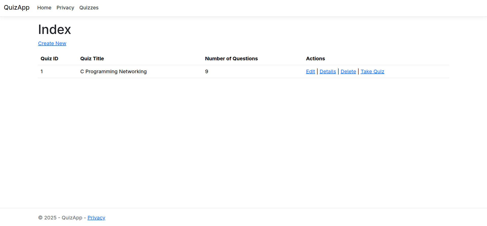

## Model Relation

```
Quiz ↔ Question (one-to-many)

Question ↔ Answer (one-to-many)

User ↔ UserQuiz (one-to-many)

Quiz ↔ UserQuiz (one-to-many)
```

## Demonstration

### Home Page



### Quiz Session


### Summary


